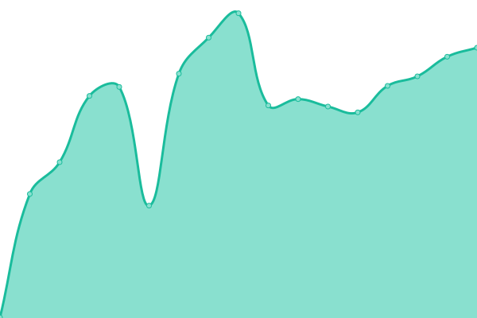
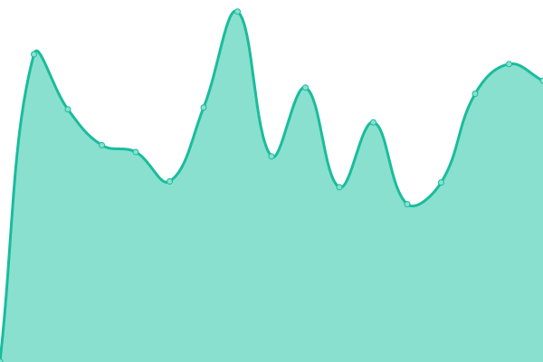
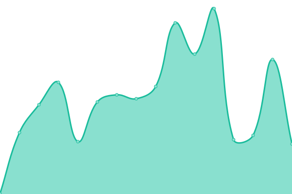
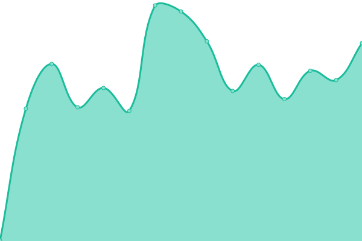

# [📈 Live Status](https://status.wise.hpa.ai): <!--live status--> **🟩 All systems operational**

This repository contains the open-source uptime monitor and status page for [HPA - High Performance Analytics](https://hpa.ai), powered by [Upptime](https://github.com/upptime/upptime).

With [Upptime](https://upptime.js.org), you can get your own unlimited and free uptime monitor and status page, powered entirely by a GitHub repository. We use [Issues](https://github.com/high-performance-analytics/hpa-uptime/issues) as incident reports, [Actions](https://github.com/high-performance-analytics/hpa-uptime/actions) as uptime monitors, and [Pages](https://status.wise.hpa.ai) for the status page.

<!--start: status pages-->
<!-- This summary is generated by Upptime (https://github.com/upptime/upptime) -->
<!-- Do not edit this manually, your changes will be overwritten -->
<!-- prettier-ignore -->
| URL | Status | History | Response Time | Uptime |
| --- | ------ | ------- | ------------- | ------ |
|  [WISE Webapp](https://wise.hpa.ai) | 🟩 Up | [wise-frontend.yml](https://github.com/high-performance-analytics/hpa-uptime/commits/HEAD/history/wise-frontend.yml) | 

 627ms
     
 | 

<a href="https://status.hpa.ai/history/wise-frontend">100.00%</a>
    

|  [WISE APIs](https://wise-api.hpa.ai/hally/health) | 🟩 Up | [wise-backend.yml](https://github.com/high-performance-analytics/hpa-uptime/commits/HEAD/history/wise-backend.yml) | 

 879ms
     
 | 

<a href="https://status.hpa.ai/history/wise-backend">100.00%</a>
    

|  [HIVE Waste Webapp](https://hivewaste.hpa.ai) | 🟩 Up | [hive-waste-frontend.yml](https://github.com/high-performance-analytics/hpa-uptime/commits/HEAD/history/hive-waste-frontend.yml) | 

 480ms
     
 | 

<a href="https://status.hpa.ai/history/hive-waste-frontend">100.00%</a>
    

|  [HIVE Waste APIs](https://hivewaste-api.hpa.ai/health/) | 🟩 Up | [hive-waste-backend.yml](https://github.com/high-performance-analytics/hpa-uptime/commits/HEAD/history/hive-waste-backend.yml) | 

 752ms
     
 | 

<a href="https://status.hpa.ai/history/hive-waste-backend">100.00%</a>
    

<!--end: status pages-->

[**Visit our status website →**](https://status.hpa.ai/)

## 📄 License

- Powered by: [Upptime](https://github.com/upptime/upptime)
- Code: [MIT](./LICENSE) © [Anand Chowdhary](https://anandchowdhary.com), supported by [Pabio](https://pabio.com)
- Data in the `./history` directory: [Open Database License](https://opendatacommons.org/licenses/odbl/1-0/)
